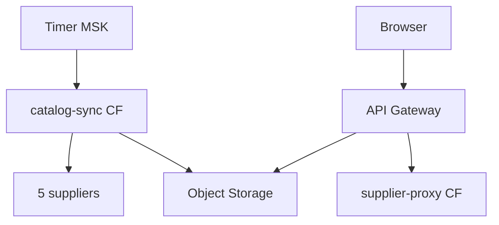

# Yandex Cloud: runbook

::: tip Статус: проверено по коду
Порядок работ из `yandex/catalog-sync/README.md` и `yandex/supplier-proxy/README.md`. Без секретов.
:::

## Топология



## Компоненты

| Компонент | Роль |
| --- | --- |
| Object Storage | `stores/{storeId}/meta.json`, `snapshot.json` |
| catalog-sync CF | Timer sync, GET meta/snapshot |
| supplier-proxy CF | CORS `/v2?url=`, legacy 403 |
| API Gateway | Маршруты proxy + catalog + direct b2b/z34/vershina |
| Timer ×4 | 08:00, 09:30, 12:00, 15:00 MSK |

## Безопасная эксплуатация

1. **Не коммитьте** SA keys и upstream credentials.
2. Bucket — **закрытый**; чтение через Gateway SA.
3. Роли SA: `storage.editor` (CF write), `storage.viewer` (GW read), `functions.invoker` (Timer).
4. После смены env — новая version CF + проверка `verify.ps1`.
5. Legacy gateway routes (`/`, `/b2b`, …) намеренно **403**.

## Деплой catalog-sync

```powershell
cd yandex\catalog-sync
npm install
.\deploy.ps1 -FunctionId <FUNCTION_ID>
```

Env: см. [Конфигурация](/01-getting-started/configuration) (cloud section).

Timer payload: строка слота `"08:00"`, `"09:30"`, …

## Деплой API Gateway

```powershell
.\yandex\supplier-proxy\deploy.ps1
.\yandex\catalog-sync\verify.ps1
```

Перед деплоем: подставить `CATALOG_BUCKET`, `service_account_id` в `apigw.yaml`.

## Проверка

| Проверка | Ожидание |
| --- | --- |
| `GET .../v2/catalog/{storeId}/meta` | JSON с `version` |
| `GET .../snapshot` | `schemaVersion`, `suppliers` |
| Manual invoke | лог `catalog-sync-finish` |
| `verify.ps1` | b2b/z34/vershina 200, size > 1MB |

## Логи

| Фильтр | Событие |
| --- | --- |
| CF catalog-sync | `catalog-sync-start`, `catalog-sync-finish` |
| supplier-proxy | `load-finish`, `proxy-error`, `blocked-host` |

Frontend: [Логи appLog](/12-operations/logging-and-diagnostics).

## Частичный сбой поставщика

Upstream fail → `keepPrevious` для категории; meta `ok: false`, `keptPrevious: true`. Пустой ответ **не** purge.

## Frontend после cloud deploy

1. Обновить `REACT_APP_CORS_PROXY` (и при необходимости `REACT_APP_CATALOG_API_BASE`)
2. `npm run deploy`

## Связанные страницы

- [Yandex catalog-sync](/06-catalog-sync/yandex-catalog-sync)
- [Supplier proxy](/07-suppliers/supplier-proxy)
- [Изменение catalog sync](/14-development/change-catalog-sync)
- [Troubleshooting](/14-development/troubleshooting)
