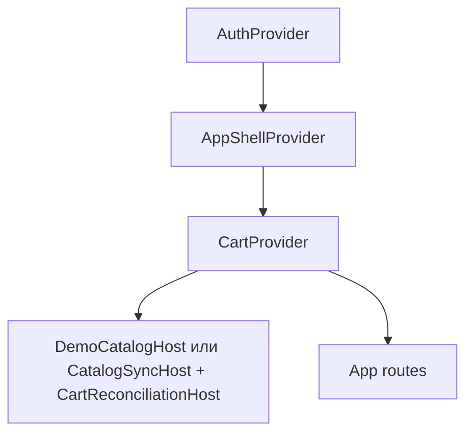

# Context и hooks

::: tip Статус: проверено по коду
Три провайдера образуют цепочку зависимостей: Auth → AppShell → Cart. Подробности — [дерево провайдеров](/02-architecture/frontend-provider-tree).
:::

## Карта провайдеров

---

## AuthProvider — `src/auth/AuthContext.jsx`

### Exports

| Export | Сигнатура | Назначение |
| --- | --- | --- |
| `AuthProvider` | `({ children }) => JSX` | Provider + restore на mount |
| `useAuth` | `() => AuthContextValue` | Hook доступа к auth state |

### `useAuth()` — возвращаемое значение

| Поле | Тип | Назначение |
| --- | --- | --- |
| `isAuthenticated` | `boolean` | Есть **staff** session (`staffWorkspace`), не demo-path |
| `isReady` | `boolean` | Restore staff-сессии завершён |
| `isWorkspaceReady` | `boolean` | Demo-path **или** restore завершён и есть staff workspace |
| `workspace` | `{ login, accountId, storeId } \| null` | На `/demo*` всегда `DEMO_WORKSPACE`; иначе staff |
| `signIn` | `(email, password) => Promise<boolean>` | UI-обёртка session login + workspace |
| `login` | `string \| null` | Нормализованный login текущего workspace |
| `logout` | `() => void` | session.logout + reset state |

### Side effects

- **Mount:** `restore()` → `createWorkspace` → `setWorkspace`.
- **Generation guard:** `generationRef` для race-safe async.
- **Хранилище:** `localStorage` через `session.js`.

`AuthProvider` не активирует IndexedDB. Привязка `workspace.storeId` к IDB выполняется в `AppShellProvider`, который расположен ниже Auth в дереве Provider. На `/demo*` публикует `DEMO_WORKSPACE` (нужен Router: `useLocation`).

### Кто вызывает

`src/index.js` оборачивает приложение; `LoginPage`, guards, `useLogout`.

### Тесты

`AuthContext.test.jsx` — restore, signIn, logout races.

### Страница

[Клиентская модель auth](/04-auth/client-auth-model).

---

## session.js — `src/auth/session.js`

### `login(email, password, { isCurrent })`

| | |
| --- | --- |
| **Сигнатура** | `async function login(email, password, { isCurrent = () => true } = {})` |
| **Возврат** | `Promise<{ login: string } \| false>` |
| **Async** | Web Crypto HMAC + wrapPassword |
| **Side effects** | Запись `auth.login.v1`, `auth.secret.v1` в localStorage |
| **Алгоритм** | normalizeLogin → hmacLogin → compare VERIFIERS → wrapPassword(fingerprint) → writeStorage |
| **Ошибки** | false при неверном пароле; `auth.infra_failed` + logout при persist error |
| **Кто вызывает** | `AuthProvider.signIn` |
| **Тесты** | `session.test.js` |
| **Страница** | [Session, crypto](/04-auth/session-crypto-workspace) |

### `restore({ isCurrent })`

| | |
| --- | --- |
| **Возврат** | `Promise<{ login: string } \| null>`; plaintext password наружу не возвращается |
| **Side effects** | Чтение localStorage, unwrapPassword |
| **Ошибки** | null + logout при invalid verifier / unwrap fail |
| **Кто вызывает** | `AuthProvider` mount |
| **Страница** | [Гонки и logout](/04-auth/races-and-logout) |

### `logout()`

| | |
| --- | --- |
| **Возврат** | `void` (sync) |
| **Side effects** | removeStorage login/secret keys |
| **Кто вызывает** | `useLogout`, failed restore, failed login persist |
| **Страница** | [Гонки и logout](/04-auth/races-and-logout) |

---

## workspace.js

### `createWorkspace(loginName)`

| | |
| --- | --- |
| **Сигнатура** | `async function createWorkspace(loginName)` |
| **Возврат** | `Promise<{ login, accountId, storeId }>` |
| **Pure часть** | `resolveStoreId({ accountId, login, ...config })` из env map |
| **Side effects** | нет (async только для createAccountId) |
| **Кто вызывает** | `AuthProvider` после login/restore |
| **Тесты** | `workspace.test.js` |
| **Страница** | [Session, crypto](/04-auth/session-crypto-workspace) |

### `resolveStoreId(options)`

Сигнатура:
`resolveStoreId({ accountId, login, storeMap = REACT_APP_STORE_MAP, fallbackStoreId = REACT_APP_STORE_ID })`.
Sync; сначала ищет mapping по accountId, затем по normalized login, затем
возвращает trimmed fallback.

---

## crypto.js — grouped exports

| Export | Назначение | Async |
| --- | --- | --- |
| `normalizeLogin(email)` | trim + lower email | sync |
| `createAccountId(loginName)` | SHA-256 hex | async |
| `hmacLogin(login, password)` | HMAC-SHA256 digest | async |
| `wrapPassword(password, fingerprint)` | AES-GCM envelope | async |
| `unwrapPassword(secret, fingerprint)` | decrypt или throw | async |

**Side effects:** Web Crypto API only. **Тесты:** `crypto.test.js`. **Страница:** [Session, crypto](/04-auth/session-crypto-workspace).

---

## useLogout — `src/auth/useLogout.js`

### `useLogout()`

| | |
| --- | --- |
| **Возврат** | memoized callback `() => void` |
| **Алгоритм** | `cart.flush()` → `cart.detach()` → `indexedDBService.invalidateActiveStore(workspace.storeId)` → auth `logout()` → navigate home |
| **Side effects** | localStorage cart flush, IDB close, navigation |
| **Кто вызывает** | `SiteHeader` (`const logout = useLogout()`) |
| **Тесты** | `useLogout.test.jsx`, `useLogout.cartPolicy.test.jsx` |
| **Страница** | [Гонки и logout](/04-auth/races-and-logout) |

---

## AppShellProvider — `src/app/AppShellContext.jsx`

### `useAppShell()`

| Поле | Назначение |
| --- | --- |
| `clientMode` / `setClientMode` | Режим клиента (скрытие B2B) |
| `catalogDataVersion` | Bump → поиск/showcase перечитывают IDB |
| `catalogSnapshotVersion` | Версия последнего apply |
| `catalogBootstrap` | `{ phase: 'idle' \| 'blocking' \| 'ready' \| 'error', progress, label, error?, waitForShowcase? }` — cold-start шторка; `waitForShowcase` только на пустом IDB |
| `setCatalogBootstrap` | Host выставляет blocking/ready/error |
| `registerCatalogBootstrapRetry` / `retryCatalogBootstrap` | «Повторить» на шторке |
| `notifyCatalogSurfaceReady` | Активная витрина сообщает, что полки settled |
| `catalogSurfaceHold` | Держит opacity зоны результатов, пока cold-start шторка не начнёт exit |
| `bumpCatalogDataVersion` | После snapshot commit |
| `notifyCatalogApplied(version)` | От channel / sync host |
| `sessionResetKey` | Увеличивается при клике по бренду; `App.js` использует его в React key поисковых панелей |
| `workspaceResetKey` | `accountId:storeId` либо `guest`; граница сброса UI и async guards |
| `continueSelection` / `handleBrandClick` | Nav helpers для landing |
| `lastBackgroundPath` | Return path для dual-mount |

**Side effects:** `clientMode` в localStorage; `useLayoutEffect` вызывает `setActiveStore`/`invalidateActiveStore` и сбрасывает `catalogBootstrap` при смене workspace; подписка на catalog channel обновляет версии; `CatalogBootstrapOverlay` порталится на `document.body` при `blocking`/`error` и на cold start держится до settled витрины, затем opacity 50ms. **Страница:** [AppShell state](/03-routing-shell/app-shell-state).

---

## CartProvider — `src/cart/CartContext.jsx`

### Exports

| Export | Назначение |
| --- | --- |
| `CartProvider` | Provider с namespace account/store |
| `CartProviderCore` | Тестируемое ядро (storage/syncFactory inject) |
| `useCart` | Hook корзины |
| `getCartStorageKey` | Ключ localStorage для store |

`CartProviderCore` принимает `workspace`, `isWorkspaceReady`, `children` и тестовые точки инъекции `storage`, `syncFactory`. При готовности workspace тихо вызывает `detectLegacyCart` → migrate или discard. Обычный `CartProvider` получает workspace из Auth Context и передаёт его ядру.

### `useCart()` — операции

| Метод | Сигнатура | Side effects |
| --- | --- | --- |
| `addItem` | `(item, category, qty?) => boolean` | validate/snapshot → write → broadcast |
| `increment` / `decrement` | `(key) => boolean` | increment ограничен stock; decrement не ниже `1` |
| `removeItem` | `(key) => boolean` | persist + publish |
| `clear` | `() => boolean` | удалить storage key, заменить runtime пустым envelope, publish |
| `flush` | `() => boolean` | синхронно записать текущий envelope |
| `detach` | `() => CartEnvelope \| null` | flush, закрыть sync, очистить runtime; вернуть прежний snapshot |
| `reconcileCatalog` | `({ version, results }) => boolean` | reconcileCartItems + commit |
| `getItem` | `(itemOrKey) => CartItem \| null` | read memory |
| `totalQuantity` / `totals` | derived | pure from items |

**Состояние:** in-memory `items`, `isLoaded`; persist envelope v3 в localStorage. **Тесты:** `CartContext.test.jsx`. **Страница:** [Домен корзины](/09-cart/cart-domain-and-storage).

---

## paths.js — routing helpers

Группа **pure/sync** функций для login-modal и basename:

| Export | Назначение |
| --- | --- |
| `PATHS`, `DEFAULT_APP_HOME`, `DEFAULT_DEMO_HOME`, `ROUTER_BASENAME` | Константы маршрутов, включая `/demo*` |
| `isLoginQueryOpen`, `stripLoginQuery` | Query `?login=1` |
| `resolvePostLoginPath`, `resolveLoginDismissPath` | Безопасный redirect; post-login не возвращает `/demo*` |
| `isSafeRelativePath` | Open-redirect guard |
| `pageFromPathname`, `isMarketingPath`, `isAppPath`, `isDemoPath`, `isStaffAppPath` | Классификация URL |
| `toAppPath`, `appHomePath` | Staff vs demo-пути одной страницы |

**Кто вызывает:** `App.js`, `LoginPage`, tests. **Тесты:** `paths.test.js`. **Страница:** [Маршруты](/03-routing-shell/routes-and-login-modal).

---

## appMode.js

| Export | Назначение |
| --- | --- |
| `isDemo(pathname)` | Prefix `/demo`; не env и не константа модуля |
| `canUseApp(isAuthenticated, pathname)` | Staff session **или** demo-path |

**Тесты:** `appMode.test.js`. **Страница:** [AppShell](/03-routing-shell/app-shell-state), [ADR-009](/adr/009-demo-url-frozen-snapshot).

## demoWorkspace.js

| Export | Назначение |
| --- | --- |
| `DEMO_WORKSPACE` | `{ login, accountId, storeId } = 'demo'` |
| `DEMO_STORE_ID` | `'demo'` |

**Страница:** [Клиентская модель auth](/04-auth/client-auth-model).

## Связанные страницы

- [Владение состоянием](/02-architecture/state-ownership)
- [Справочник: сервисы](/13-code-reference/services)
