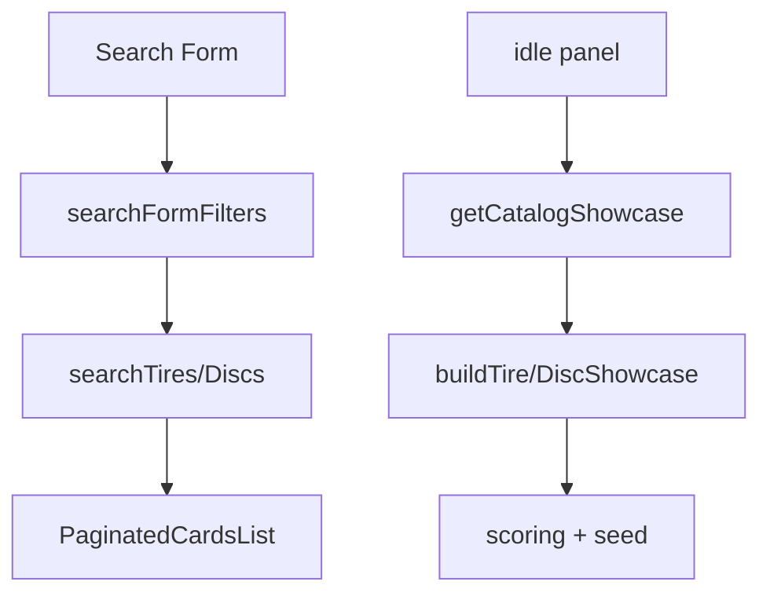

# Доменные модули

::: tip Статус: проверено по коду
Pure/domain логика без React: `src/catalog/` и domain-часть `src/cart/`. UI импортирует эти модули, но не наоборот.
:::

## 1. Catalog search — `src/catalog/search/`

### `mapTireFormValuesToSearchFilters(formValues)`

| | |
| --- | --- |
| **Сигнатура** | `function mapTireFormValuesToSearchFilters(formValues)` |
| **Возврат** | объект filters для `searchTires` |
| **Pure** | да |
| **Алгоритм** | Ant Form values → нормализация чисел, диаметра, season, brand |
| **Кто вызывает** | `TiresSearchParameters` |
| **Тесты** | `searchFormFilters.test.js` |
| **Страница** | [Поиск шин](/08-search-showcase/tire-and-disc-search) |

### `mapDiscFormValuesToSearchFilters(formValues)`

Аналог для дисков → `searchDiscs`.

### Каскад формы — `searchFormCascade.js`

| Export | Назначение |
| --- | --- |
| `didOnlyIrrelevantSearchFieldsChange` | brand/чекбоксы/шипы не пересчитывают facets |
| `scheduleDebounced` / `SEARCH_FACET_DEBOUNCE_MS` | 16 ms coalesce каскада |
| `beginCatalogSearchRequest` / `settleCatalogSearchLoading` | spinner «Найти» и overlap foreground/background |

**Тесты:** `searchFormCascade.test.js`. **Страница:** [Поиск](/08-search-showcase/tire-and-disc-search), [гонки](/08-search-showcase/async-race-guards).

---

## 2. Catalog core — `src/catalog/core/`

| Export | Назначение | Тесты |
| --- | --- | --- |
| `isIkonBrand(brand)` | Проверка бренда Ikon | `isIkonBrand.test.js` |
| `resolveCatalogModel(item)` | Display model string | `resolveCatalogModel.test.js` |
| `mergePreferredShowcaseCandidates(a, b, limit)` | Merge preferred pools | `mergePreferredShowcaseCandidates.test.js` |

Все **sync pure**. **Страница:** [Showcase](/08-search-showcase/showcase-selection).

---

## 3. Catalog showcase — `src/catalog/showcase/`

### `getCatalogShowcase(options)`

| | |
| --- | --- |
| **Сигнатура** | `async function getCatalogShowcase({ kind, catalogDataVersion = 0, catalogSnapshotVersion = '', workspaceResetKey = 'guest', now = new Date() } = {})` |
| **kind** | `'discs'` выбирает диски; остальные значения используют ветку `tires` |
| **Возврат** | Результат `buildTireShowcase` или `buildDiscShowcase`: `{ kind, empty, chips, chipsTitle, shelves, ... }` |
| **Async** | IDB collect candidates → cache/SWR fallback → resolve seed → build showcase |
| **Side effects** | IDB read и обновление module-level cache по kind/workspace/data version |
| **Внутренние вызовы** | `collectTire/DiscShowcaseCandidates`, `buildTireShowcase`, `buildDiscShowcase`, `resolveShowcaseSeed` |
| **Кто вызывает** | `CatalogShowcase` в effect; SearchParameters только монтируют его при `searchResults === null` |
| **Тесты** | `getCatalogShowcase.test.js` |
| **Страница** | [Showcase selection](/08-search-showcase/showcase-selection) |

### `buildTireShowcase({ candidates, isEmpty, now, seed })`

Чистая синхронная сборка. При пустом каталоге возвращает chips без полок. Иначе определяет сезон по `now`, оставляет товары с достаточным остатком, выбирает сезонный пул и формирует единственную полку `season-hits` через `pickMixedSeasonHits`: уникальные модели Ikon из сезонного whitelist смешиваются с остальными кандидатами и получают стабильный порядок от `seed`. Лимиты и тексты берутся из `SHOWCASE_CONFIG`. **Тесты:** `buildTireShowcase.test.js`.

### `buildDiscShowcase({ candidates, isEmpty, seed })`

Чистая синхронная сборка. После проверки остатка оставляет только литые диски настроенного showcase-поставщика, перемешивает их детерминированно и обрезает до `popularModelsCount`. Другими типами или поставщиками полка не дополняется. Пустой каталог возвращает только chips. **Тесты:** `buildDiscShowcase.test.js`.

### Scoring и seed (группа)

| Модуль | Exports | Назначение |
| --- | --- | --- |
| `scoring.js` | `scoreCatalogItem`, `pickTopDiverse`, `isStocked` | Rank + diversity |
| `showcaseSeed.js` | `resolveShowcaseSeed`, `shuffleItems`, `createSeededRandom` | Deterministic order per snapshot version |
| `ikonSeasonHits.js` | `pickMixedSeasonHits`, `pickUniqueIkonHits`, … | Ikon season logic |
| `showcaseConfig.js` | `SHOWCASE_CONFIG`, `getCatalogSeasonFromDate` | Limits и season window |

**Страница:** [Showcase](/08-search-showcase/showcase-selection), [контракты](/11-testing/contract-catalog).

---

## 4. Cart domain — `src/cart/` (non-React)

### cartUtils.js — ключевые exports

### `reconcileCartItems(cartItems, catalogItemsByKey)`

| | |
| --- | --- |
| **Сигнатура** | `function reconcileCartItems(cartItems, catalogItemsByKey)` |
| **Возврат** | `{ items, removed, updated }` |
| **Pure** | да |
| **Алгоритм** | Для каждой строки: lookup catalog → update price/stock/sellability или mark removed |
| **Кто вызывает** | `CartContext.reconcileCatalog`, `CartReconciliationHost` |
| **Тесты** | `cartUtils.test.js` |
| **Страница** | [Catalog reconciliation](/09-cart/catalog-reconciliation) |

### Группа pricing/stock helpers

`getUnitSellingPrice`, `getUnitB2bPrice`, `isCatalogItemSellable`, `clampCartQty`, `getCartItemKey`, `parseStock` — **sync pure**. Используются Context, AddToCart, BasketPage.

---

### cartStorage.js — persist envelope v3

| Export | Назначение |
| --- | --- |
| `readCartEnvelope(storage, accountId, storeId)` | Миграция account-only ключа и parse localStorage |
| `writeCartEnvelope(storage, accountId, storeId, envelope)` | Валидация и `storage.setItem` |
| `createCartEnvelope({ items, revision, updatedAt })` | Валидированный envelope v3 |
| `getCartStorageKey(accountId, storeId)` | Namespace `accountId` + безопасный `storeId` |
| `migrateAccountCartToStore(...)` | Account → store namespace |
| `validateCartEnvelope` / `parseCartEnvelope` | Schema guards |

**Side effects:** localStorage. **Тесты:** `cartStorage.test.js`. **Страница:** [Домен корзины](/09-cart/cart-domain-and-storage).

---

### cartSync.js

### `createCartSync(options)`

Сигнатура:
`createCartSync({ accountId, storeId, storage = window.localStorage, windowObject = window, BroadcastChannelClass = window.BroadcastChannel, onEnvelope })`.
Factory изолирует сообщения по account/store, использует BroadcastChannel и
`storage` event fallback и возвращает `publish`/`close`. Точки инъекции нужны
тестам и окружениям без нативного channel. **Тесты:** `cartSync.test.js`.
**Страница:** [Миграция и вкладки](/09-cart/migration-and-multitab).

---

### legacyCartMigration.js

| Export | Назначение |
| --- | --- |
| `detectLegacyCart()` | Есть ли старые ключи |
| `migrateLegacyCart()` | Import в envelope v3 |
| `discardLegacyCart()` | Удаление legacy |

`CART_CATEGORIES` и `isCartCategory` фиксируют доменные категории корзины: `tyres` и `discs`. Это намеренно отличается от имени IDB store `tires`.

**Тесты:** `legacyCartMigration.test.js`. **Страница:** [Миграция](/09-cart/migration-and-multitab).

---

## Диаграмма домена showcase

## Связанные страницы

- [Справочник: сервисы](/13-code-reference/services)
- [Справочник: компоненты](/13-code-reference/components)
