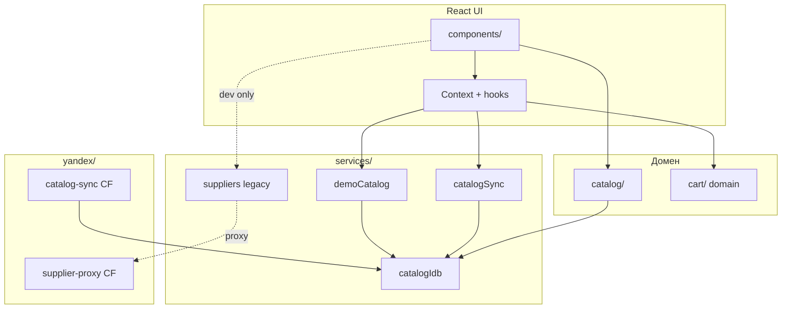

# Справочник кода

::: tip Статус: проверено по коду
Индекс сгруппирован по назначению, а не по алфавиту файлов. Детальные учебные разборы — в модульных разделах; здесь — карта exports, связи и быстрый переход.
:::

## Назначение

Единая точка входа в исходники Ivanor: где искать компонент, сервис или доменную функцию, кто её вызывает и какая учебная страница объясняет поведение подробно.

## Карта разделов

| Раздел | Что внутри | Учебные страницы |
| --- | --- | --- |
| [Компоненты](/13-code-reference/components) | Shell, поиск, shared UI | [UI каталога](/10-ui/catalog-components), [корзина](/10-ui/basket-and-client-mode), [поиск](/08-search-showcase/tire-and-disc-search) |
| [Context и hooks](/13-code-reference/context-and-hooks) | Auth, Cart, AppShell, useLogout | [Auth](/04-auth/client-auth-model), [корзина](/09-cart/cart-domain-and-storage), [AppShell](/03-routing-shell/app-shell-state) |
| [Сервисы](/13-code-reference/services) | IDB, sync, suppliers, validation | [IndexedDB](/05-catalog-storage/indexeddb-schema), [autosync](/06-catalog-sync/frontend-autosync), [поставщики](/07-suppliers/supplier-adapters) |
| [Доменные модули](/13-code-reference/domain-modules) | catalog/, cart/ utils | [Showcase](/08-search-showcase/showcase-selection), [reconciliation](/09-cart/catalog-reconciliation) |
| [Утилиты](/13-code-reference/utilities) | appLog, fetchSupplier, theme, config | [Логи](/12-operations/logging-and-diagnostics), [конфигурация](/01-getting-started/configuration) |
| [Yandex Cloud Functions](/13-code-reference/yandex-functions) | catalog-sync, supplier-proxy | [Cloud sync](/06-catalog-sync/yandex-catalog-sync), [proxy](/07-suppliers/supplier-proxy) |
| [Тестовые наборы](/13-code-reference/test-suites) | Jest по подсистемам | [Стратегия](/11-testing/test-strategy), [контракты](/11-testing/contract-catalog) |

## Как читать карточку функции

Каждая важная export-функция описана блоком:

- **Путь и имя** — актуальный файл.
- **Назначение** — одна ответственность простыми словами.
- **Сигнатура** — из кода.
- **Параметры / возврат / async / side effects / состояние** — контракт.
- **Кто вызывает / внутренние вызовы** — направление зависимостей.
- **Алгоритм и ошибки** — кратко; подробности на учебной странице.
- **Пример / тесты / ссылка** — проверяемость.

Тривиальные helpers (форматирование строк, re-export barrel) сведены в таблицы без отдельной карточки.

## Сквозная карта подсистем

## Active, legacy, unused

| Код | Статус | Примечание |
| --- | --- | --- |
| `catalogSyncService`, `catalogIdbSession` | **active** | Production-путь каталога |
| `DemoCatalogHost`, `loadFrozenDemoCatalog` | **active** | `/demo*` frozen snapshot, без live autosync |
| `supplierOrchestrator`, `fetchSupplier` (browser load) | **legacy / dev** | Не основной runtime; см. [адаптеры](/07-suppliers/supplier-adapters) |
| `indexedDBService.js` | **facade** | Re-export; реализация в `catalogIdb/` |
| `saveTires`, `replaceTiresForSupplier` | **legacy API** | Публичны, но snapshot — основной writer |

## Связанные страницы

- [План документации](/documentation-plan)
- [Статус документации](/documentation-status)
- [Шаблон учебной страницы](/page-template)
- [ADR](/adr/)
