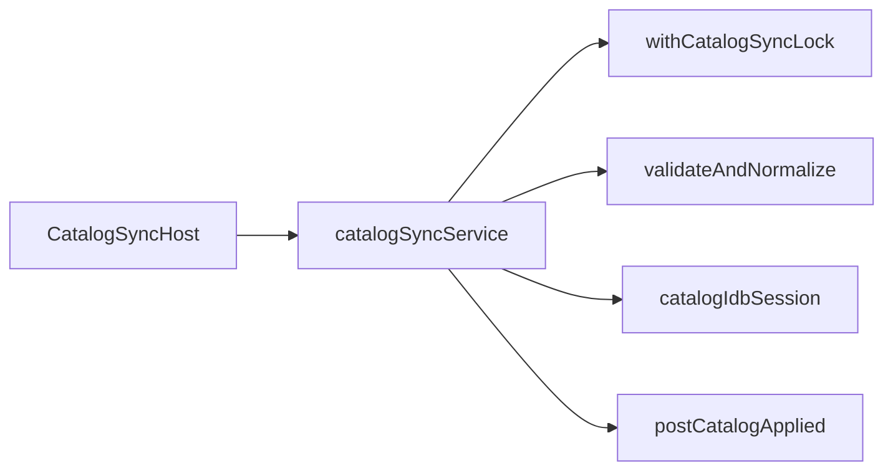

# Сервисы

::: tip Статус: проверено по коду
Production runtime каталога: **sync → validation → IDB**. Legacy supplier load в браузере не входит в основную цепочку.
:::

## 1. Catalog Sync — `src/services/catalogSync/`

### `checkAndSyncCatalog(options?)`

| | |
| --- | --- |
| **Путь** | `catalogSyncService.js` |
| **Сигнатура** | `async function checkAndSyncCatalog({ force = false, storeId, signal } = {})` |
| **Назначение** | Version gate: meta → snapshot → apply если версия новее |
| **Async** | fetch meta/snapshot, lock, IDB transaction |
| **Side effects** | localStorage version key, IndexedDB, `postCatalogApplied` |
| **Состояние** | `getLocalCatalogVersion` / `setLocalCatalogVersion` per storeId |
| **Внутренние вызовы** | `withCatalogSyncLock`, `validateAndNormalizeCatalogSnapshot`, `applyCatalogSnapshot`, indexedDBService |
| **Ошибки** | `404`/пустой ответ → `skipped`; network, JSON, validation или IDB failure → log + `error`; abort/stale store → `skipped` |
| **Кто вызывает** | `CatalogSyncHost`, tests |
| **Тесты** | `catalogSyncService.test.js`, `catalogSyncService.commitBoundary.test.js` |
| **Страница** | [Frontend autosync](/06-catalog-sync/frontend-autosync) |

### `applyCatalogSnapshot(snapshot, options?)`

Сигнатура: `applyCatalogSnapshot(snapshot, { storeId, generation } = {})`. Frontend writer сначала валидирует весь wire snapshot, затем передаёт нормализованные команды в одну общую IDB-транзакцию для `tires`, `discs` и `metadata`. Строковый второй аргумент поддерживается как compatibility-форма `storeId`.

### `validateAndNormalizeCatalogSnapshot(raw)`

Wire JSON → normalized snapshot + validation report. Re-export из `catalogSnapshotValidation.js`.

### Envelope/report helpers

| Export | Контракт | Основная страница |
| --- | --- | --- |
| `validateSnapshotEnvelope(snapshot, collector)` | Проверяет `schemaVersion`, `version`, непустой `suppliers`; не проверяет production `storeId`/`slot` | [Snapshot protocol](/06-catalog-sync/snapshot-protocol-validation) |
| `createValidationReport({ schemaVersion, snapshotVersion, supplierCount, itemCount, normalizedCount, collector })` | Создаёт итоговый report с counts, warnings/errors и `truncated` | [Snapshot protocol](/06-catalog-sync/snapshot-protocol-validation) |

Эти helpers не выполняют I/O. Обычно вызывающая сторона использует
`validateAndNormalizeCatalogSnapshot`, а не собирает validation pipeline
вручную.

### `withCatalogSyncLock(storeId, fn)`

Web Locks API + localStorage lease fallback. **Страница:** [Locks and channels](/06-catalog-sync/locks-and-channels).

### `postCatalogApplied` / `subscribeCatalogApplied`

BroadcastChannel + storage event fallback для multi-tab. **Тесты:** `catalogSyncChannel.test.js`, `catalogSyncLock.integration.test.js`.

### Конфигурация

| Export | Назначение |
| --- | --- |
| `isCatalogSyncConfigured(storeId)` | Есть API base и разрешаемый `storeId` (обычно есть fallback из конфигурации) |
| `getCatalogStoreId(storeId)` | Нормализованный `storeId` с fallback |
| `CATALOG_SYNC_CHECK_SLOTS` | Расписание проверок МСК |
| `msUntilNextSyncCheck(now?)` | ms до ближайшего слота |

---

## 2. Catalog IndexedDB — `src/services/catalogIdb/`

### Facade: `src/services/indexedDBService.js`

Re-export schema, filters, validation + **default** `catalogIdbSession`.

### `catalogIdbSession` — singleton

Ключевые методы (active path):

| Метод | Сигнатура | Назначение |
| --- | --- | --- |
| `setActiveStore(storeId)` | sync | Привязка DB `CatalogDatabase.<encodeURIComponent(storeId)>` и возврат generation |
| `invalidateActiveStore(storeId?)` | sync | Close + clear active; optional id не даёт отсоединить другой store |
| `ensureCatalogReady()` | async | Open + migration |
| `applyCatalogSnapshot(commands, version)` | async | Atomic apply нормализованных команд + metadata version |
| `searchTires(filters)` | async | RAM bucket + post-filter |
| `searchDiscs(filters)` | async | RAM bucket + post-filter |
| `getAvailableParameterOptions` | async | Facets шин из RAM facet-rows |
| `getAvailableDiscParameterOptions` | async | Facets для дисков |
| `collectTireShowcaseCandidates` | async | Pool для витрины |
| `collectDiscShowcaseCandidates` | async | Pool для витрины |
| `readCartCatalogItems(keys)` | async | Read-before-add |

**Legacy public API (не основной writer):** `saveTires`, `replaceTiresForSupplier`, `saveDiscs`, …

**Side effects:** IndexedDB read/write; connection cache per storeId.

**Кто вызывает:** sync service, search components, showcase, AddToCart, reconciliation.

**Тесты:** `indexedDBService.test.js`, `indexedDBService.fakeIndexedDB.test.js`,
`catalogIdbQueries.test.js`, `catalogIdbMemory.test.js`,
`catalogReadCache.fakeIndexedDB.test.js`.

**Страницы:** [Схема IDB](/05-catalog-storage/indexeddb-schema), [queries/facets](/05-catalog-storage/queries-filters-facets), [lifecycle](/05-catalog-storage/lifecycle-and-migration).

### Вспомогательные модули IDB

| Модуль | Exports (группа) | Назначение |
| --- | --- | --- |
| `catalogSchema.js` | `CATALOG_DB_*`, indexes | Имена stores и версия |
| `catalogIdbMemory.js` | `createCategoryMemory`, `filterIndexedItems` | RAM-индексы активного generation |
| `catalogIdbQueries.js` | `pickEqualityFilterKey`, `pickEqualityIndex`, hints | Выбор equality-ключа |
| `catalogSearchFilters.js` | `matchesTireSearchFilters`, … | JS post-filter |
| `catalogFacetOptions.js` | `collectTireFacetOptions`, … | Агрегация options |
| `catalogItemValidation.js` | `prepareCatalogItems`, … | Pre-write validation |

`prepareCatalogItems` и `validateCatalogItemsForSupplier` относятся к legacy/per-supplier write API. Это отдельный контракт от `catalogSnapshotValidation.js`: production snapshot валидируется целиком до единственного commit.

---

## 3. Suppliers — `src/services/suppliers/` (legacy browser path)

::: warning Legacy
`supplierOrchestrator.loadAllSuppliersData` — сохранённый ручной путь. Production браузер читает snapshot из Object Storage.
:::

| Модуль | Export | Назначение |
| --- | --- | --- |
| `supplierOrchestrator.js` | `loadSupplierData`, `loadAllSuppliersData` | Параллельная загрузка 5 поставщиков |
| `*/index.js` ×5 | default adapter | `{ label, loadTyres, loadDiscs }` |
| `*/request.js` | `request*Tyres/Discs` | HTTP через proxy |
| `*/transformers.js` | `transformTyres/Discs` | Raw → unified model |
| `shared/fetchXmlJson.js` | `fetchXmlJson` | XML parse helper |
| `shared/deriveModel.js` | `deriveModelFromTitle`, … | Title parsing |

**Cloud reuse:** `yandex/catalog-sync/src/suppliers/transforms.js` re-export тех же transformers.

**Страницы:** [Адаптеры](/07-suppliers/supplier-adapters), [Transformers](/07-suppliers/transformers).

---

## 4. dataTransformers.js

| Export | Сигнatura | Назначение |
| --- | --- | --- |
| `getMargin(supplier)` | sync | Коэффициент маржи |
| `calculateSellingPrice(base, supplier)` | sync | B2B цена |

Pure; используется transformers и UI price strip.

---

## Диаграмма сервисного слоя

## Связанные страницы

- [Изменение catalog sync](/14-development/change-catalog-sync)
- [Изменение IndexedDB](/14-development/change-indexeddb)
- [Справочник: домен](/13-code-reference/domain-modules)
