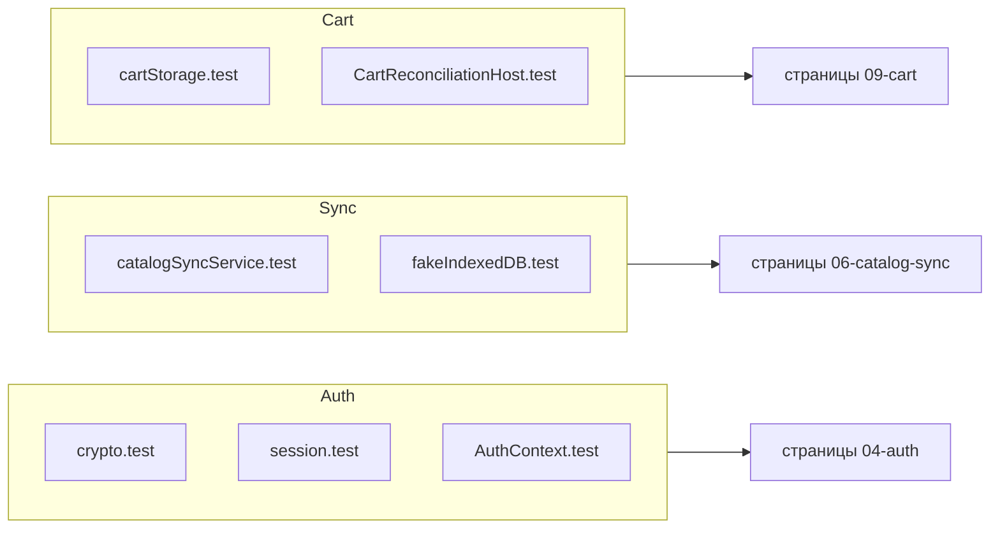

# Тестовые наборы

::: tip Статус: проверено по коду
52 test-файлов под `src/` входят в корневой `npm test`. Ещё один тестовый файл `yandex/catalog-sync` запускается отдельной cloud-командой. Карта трассировки контрактов — [contract-catalog](/11-testing/contract-catalog).
:::

## Инструменты

| Инструмент | Назначение |
| --- | --- |
| Jest (CRA) | Runner |
| Testing Library | Component/integration |
| fake-indexeddb | IDB в Node |
| user-event | UI interactions |

Setup: `src/setupTests.js`. CI: `.github/workflows/test.yml`.

---

## Auth (6 файлов)

| Файл | Инварианты |
| --- | --- |
| `auth/crypto.test.js` | HMAC, wrap/unwrap roundtrip |
| `auth/session.test.js` | login/restore/logout, verifier list |
| `auth/workspace.test.js` | storeId resolution |
| `auth/AuthContext.test.jsx` | Provider lifecycle |
| `auth/useLogout.test.jsx` | logout sequence |
| `auth/useLogout.cartPolicy.test.jsx` | flush/detach policy |

**Учебные страницы:** [Auth model](/04-auth/client-auth-model), [Races](/04-auth/races-and-logout).

---

## Cart (7 файлов)

| Файл | Инварианты |
| --- | --- |
| `cart/cartUtils.test.js` | reconcile, pricing, sellability |
| `cart/cartStorage.test.js` | envelope v3 parse/write |
| `cart/cartSync.test.js` | multitab broadcast |
| `cart/legacyCartMigration.test.js` | legacy keys |
| `cart/CartContext.test.jsx` | CRUD, namespace, silent legacy migrate |
| `cart/CartReconciliationHost.test.jsx` | post-snapshot reconcile |

**Страницы:** [Cart domain](/09-cart/cart-domain-and-storage), [Reconciliation](/09-cart/catalog-reconciliation).

---

## App / Routing (4 файла)

| Файл | Инварианты |
| --- | --- |
| `app/paths.test.js` | login redirect safety |
| `app/AppShellContext.test.jsx` | catalogBootstrap, шторка, сброс workspace, retry |
| `App.routing.test.jsx` | guards, login modal |
| `App.catalogDualMount.test.jsx` | hidden/inert panels |

**Страницы:** [Routes](/03-routing-shell/routes-and-login-modal), [Dual-mount](/03-routing-shell/dual-mount-catalog).

---

## Catalog domain (13 файлов)

| Группа | Файлы | Фокус |
| --- | --- | --- |
| search | `searchFormFilters.test.js`, `searchFormCascade.test.js` | form → filters; skip/debounce/spinner; invalidate reset; settle skip if unmounted; search timeout |
| core | `isIkonBrand`, `resolveCatalogModel`, `mergePreferred*` | pure domain |
| showcase | `getCatalogShowcase`, `buildTire/Disc`, `scoring`, `showcaseSeed`, `ikonSeasonHits`, `preferredCandidates` | vitrine algorithms |
| misc | `catalogRevalidation.test.js` | **test-local algorithm copy** — не production contract |

**Страницы:** [Showcase](/08-search-showcase/showcase-selection), [Search](/08-search-showcase/tire-and-disc-search).

---

## Components (6 файлов)

| Файл | Инварианты |
| --- | --- |
| `SiteHeader.test.jsx` | cart badge, auth links |
| `TiresSearchParameters.searchRace.test.jsx` | stale request discard, spinner, skip facets, reset during pending, pending не blank, timeout, StrictMode settle |
| `DiscsSearchParameters.searchRace.test.jsx` | stale request discard, spinner, skip facets, reset during pending, pending не blank, timeout, StrictMode settle |
| `CatalogShowcase.appLog.test.jsx` | error logging on showcase fail |
| `CatalogShowcase.bootstrap.test.jsx` | пустой store / loading → skeleton; Empty «Каталог ещё загружается» отсутствует; notify только на settled полках |
| `CatalogBootstrapOverlay.test.jsx` | шторка на blocking/error, нет на idle/ready, Escape не закрывает, МБ вместо % файла, waiting lock без 0%, waitForShowcase держит до витрины затем fade |
| `CatalogResultsFade.test.jsx` | delayed unmount 50ms, reduced-motion сразу |

**Страница:** [Async race guards](/08-search-showcase/async-race-guards).

---

## Services / IDB / Sync (15 файлов)

| Файл | Инварианты |
| --- | --- |
| `indexedDBService.test.js` | schema, basic CRUD |
| `indexedDBService.fakeIndexedDB.test.js` | snapshot apply transaction |
| `indexedDBService.searchFilters.test.js` | post-filter semantics |
| `catalogIdb/catalogFacetOptions.test.js` | facet aggregation |
| `catalogIdb/catalogIdbQueries.test.js` | index hint selection |
| `catalogIdb/catalogIdbMemory.test.js` | RAM buckets, compact facet rows |
| `catalogIdb/catalogReadCache.fakeIndexedDB.test.js` | один getAll, width vs season, workspace isolation, warmup обеих категорий, switch во время warmup |
| `catalogIdb/catalogIdbSession.readStoreAll.test.js` | abort hydrate без onsuccess отклоняет Promise; timeout getAll |
| `catalogSync/catalogSnapshotValidation.test.js` | wire validation |
| `catalogSync/catalogSyncService.test.js` | version gate, stream progress, abort, gzip mismatch |
| `catalogSync/catalogSyncService.commitBoundary.test.js` | atomic commit |
| `catalogSync/catalogSyncChannel.test.js` | broadcast |
| `catalogSync/catalogSyncLock.test.js` | lock lease, onWaiting у второго waiter |
| `catalogSync/catalogSyncLock.integration.test.js` | multi-tab writer |
| `catalogSync/CatalogSyncHost.test.jsx` | triggers, empty → blocking, non-empty без кадра blocking, onProgress → label, warmup до notify, waiting lock |

**Страницы:** [IndexedDB](/05-catalog-storage/indexeddb-schema), [Autosync](/06-catalog-sync/frontend-autosync), [Locks](/06-catalog-sync/locks-and-channels).

---

## Utils (1 файл)

`utils/appLog.test.js` — sanitization, expected errors.

---

## Yandex Cloud (1 файл)

`snapshotCommands.test.js` — `replace` / `keepPrevious` / `purge` rules.

::: warning Пробел покрытия
- `supplier-proxy` — без unit tests
- transformers — без golden fixtures
- cloud test suite не в `npm test` корня
:::

---

## Traceability diagram

## Связанные страницы

- [Стратегия тестирования](/11-testing/test-strategy)
- [Каталог контрактов](/11-testing/contract-catalog)
- [Troubleshooting](/14-development/troubleshooting)
