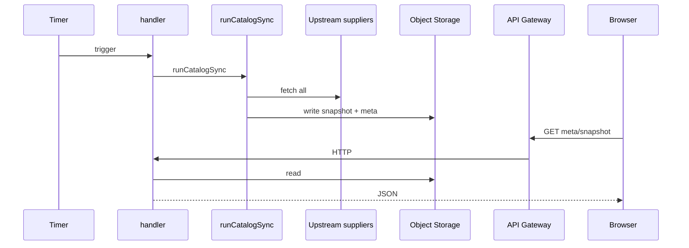

# Yandex Cloud Functions

::: tip Статус: проверено по коду
Две функции: **catalog-sync** (production pipeline каталога) и **supplier-proxy** (CORS/dev gateway). Браузер в production ходит в catalog-sync через API Gateway, не в поставщиков напрямую.
:::

## catalog-sync — `yandex/catalog-sync/`

### `handler(event, context)` — entry point

| | |
| --- | --- |
| **Путь** | `src/handler.js` |
| **Сигнатура** | `async function handler(event, context)` |
| **Триггеры** | Yandex Timer (sync), HTTP GET meta/snapshot |
| **Назначение** | Маршрутизация: run sync или отдача JSON из bucket |
| **Side effects** | Object Storage read/write, upstream HTTP |
| **Кто вызывает** | Timer, API Gateway |
| **Страница** | [Yandex catalog-sync](/06-catalog-sync/yandex-catalog-sync) |

---

### `runCatalogSync(options?)` — `src/runSync.js`

| | |
| --- | --- |
| **Сигнатура** | `async function runCatalogSync({ slot } = {})` |
| **Алгоритм** | loadAllSuppliers → buildSnapshotSuppliers → resolveCategoryCommand → writeSnapshot + writeMeta |
| **Ошибки** | partial supplier fail → `keepPrevious`; empty ≠ purge |
| **Внутренние вызовы** | `loadAllSuppliersData`, `snapshotCommands`, `storage` |
| **Страница** | [Snapshot protocol](/06-catalog-sync/snapshot-protocol-validation) |

---

### storage.js — Object Storage

| Export | Назначение |
| --- | --- |
| `readMeta(storeId)` / `writeMeta` | meta.json version |
| `readSnapshot` / `writeSnapshot` | snapshot.json body |
| `metaObjectKey`, `snapshotObjectKey` | S3 keys |
| `getBucket`, `getStoreId` | Env config |

**Side effects:** S3-compatible API (Yandex Object Storage).

---

### snapshotCommands.js

| Export | Назначение |
| --- | --- |
| `resolveCategoryCommand({ loaded, items, previousCategory })` | `replace` / `keepPrevious` / перенос подтверждённого `purge` |
| `buildSnapshotSuppliers({ previousSnapshot, loadResults, supplierKeys, getSupplierLabel })` | `suppliers` wire envelope + `metaSuppliers` |
| `readPreviousCategoryState(category)` | Materialized state legacy-array/replace/purge |
| `CATALOG_SNAPSHOT_SCHEMA_VERSION` | Schema constant |

**Тесты:** `snapshotCommands.test.js`. **Страница:** [Snapshot protocol](/06-catalog-sync/snapshot-protocol-validation).

---

### suppliers/ (cloud)

| Модуль | Exports | Назначение |
| --- | --- | --- |
| `loadAll.js` | `loadAllSuppliersData`, `SUPPLIER_LOAD_ORDER` | Parallel upstream fetch |
| `fetch.js` | `fetchJson`, `fetchXmlJson`, `fetchExcelRows` | HTTP helpers |
| `transforms.js` | re-export frontend transformers | Shared normalization |

---

### time.js

| Export | Назначение |
| --- | --- |
| `SYNC_SLOTS` | Timer slots MSK |
| `versionForSlot`, `resolveSlot` | Version string generation |

**Страница:** [Catalog lifecycle](/06-catalog-sync/catalog-lifecycle).

---

## supplier-proxy — `yandex/supplier-proxy/`

### `handler(event, context)`

| | |
| --- | --- |
| **Путь** | `index.js` |
| **Назначение** | CORS proxy к allowlisted upstream hosts |
| **Side effects** | outbound HTTP, optional debug log |
| **Защита** | Host allowlist, SSRF guards, legacy routes → 403 |
| **Кто вызывает** | API Gateway `/v2/*`, dev `setupProxy.js` |
| **Тесты** | нет unit tests в repo |
| **Страница** | [Supplier proxy](/07-suppliers/supplier-proxy) |

---

## Cloud pipeline diagram

## Env (без значений)

Cloud Function catalog-sync: см. `yandex/catalog-sync/.env.example` — `STORE_ID`, `CATALOG_BUCKET`, `AWS_*`, `*_URL` поставщиков.

**Страница:** [Yandex deployment](/01-getting-started/dev-production-deploy), [Runbook](/12-operations/yandex-runbook).

## Связанные страницы

- [Добавление поставщика](/14-development/add-new-supplier)
- [Изменение catalog sync](/14-development/change-catalog-sync)
- [Справочник: сервисы](/13-code-reference/services)
