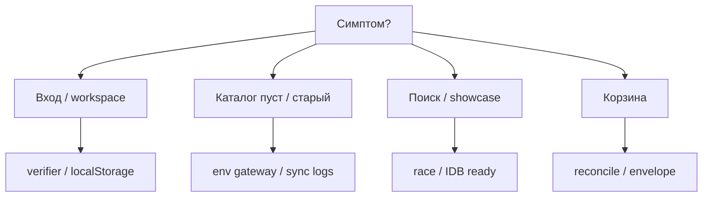

# Troubleshooting

::: tip Статус: проверено по коду
Типичные проблемы и диагностика без секретов.
:::

## Быстрая диаграмма



## Авторизация

| Симптом | Проверка | Решение |
| --- | --- | --- |
| «Неверный пароль» | `REACT_APP_AUTH_VERIFIER` после prestart | Задайте `AUTH_*`, перезапустите `npm start` |
| Сессия сбрасывается | fingerprint / unwrap | Ожидаемо при смене UA; войти снова |
| Неверный store | `REACT_APP_STORE_MAP` | Key = accountId или login |

Коды: `auth.infra_failed` — см. [appLog](/12-operations/logging-and-diagnostics).

## Каталог не обновляется

| Симптом | Проверка |
| --- | --- |
| Autosync off | `isCatalogSyncConfigured` — нужен `REACT_APP_CATALOG_API_BASE` или `CORS_PROXY` |
| Version not bumped | Network meta vs `localStorage` catalog version key |
| Stuck old data | IDB DevTools → database `CatalogDatabase.<encodeURIComponent(storeId)>` |
| Multi-tab | только одна вкладка writer (Web Locks) |

Steps:

1. Network: `GET .../meta` — есть ли новая `version`?
2. Console: filter `catalog` / appLog codes
3. Cloud logs: `catalog-sync-finish`
4. Manual invoke CF

## Поиск

| Симптом | Причина |
| --- | --- |
| Результат «мигает» | stale race — см. race tests |
| «Найти» крутит spinner, сброс не гасит | in-flight поиск не инвалидирован — `handleResetFilters` должен вызвать `invalidateCatalogSearchRequest` |
| Пустой экран при spinner | не должно: foreground не обнуляет `searchResults`; витрина / прошлый список остаются, кнопка «Найти» в `loading`. Если всё же blank — регрессия `showShowcase` |
| «Найти» крутит spinner без конца | IDB open/`getAll` без settle — должны сработать timeout 15/30 с и `errorSearch` «Каталог не отвечает». Смотреть `idb.timeout` / `idb.blocked` / `idb.hydrate` в console |
| На `npm start` вечный spinner «Найти», на `preview:prod` / Pages список/empty/ошибка появляются | Проверить `mountedRef` + StrictMode: cleanup ставит `false`, setup обязан вернуть `true`. Иначе `settleCatalogSearchLoading` делает early return и не гасит кнопку. Не отключать StrictMode «чтобы заработало» |
| На `npm start` spinner **долго**, на Pages «Найти» быстро | Ожидаемо, если кнопка всё же гаснет: другой origin → другая IndexedDB; холодный hydrate / очередь за `applyCatalogSnapshot`. IDB с github.io **не** шарится |
| Пустой showcase | IDB empty или `getCatalogShowcase` error |
| Facets пустые | filters слишком строгие / no index match |

Проверка «как Pages»: `npm run start:prod` → `http://127.0.0.1:5000/tyres_discs/` → логин → дождаться sync → «Найти» должен погасить spinner (список / empty / ошибка), без вечного loading. См. [Dev vs production](/01-getting-started/dev-production-deploy).

## Корзина

| Симптом | Причина |
| --- | --- |
| Legacy modal | `detectLegacyCart()` true |
| Цены устарели | reconciliation не сработал — проверить `CartReconciliationHost` |
| Вкладки расходятся | cartSync channel / storage event |

## Сборка и deploy

| Симптом | Причина |
| --- | --- |
| 404 на refresh | нет `404.html` copy — run `predeploy` |
| Blank page | wrong basename / `homepage` |
| Blank / 404 ассетов на локальном `serve -s build` | ассеты под `/tyres_discs`, файлы в корне `build/` — используйте `npm run preview:prod` / `start:prod` |
| Build ок, браузер connection refused | Откройте `http://127.0.0.1:5000/tyres_discs/`, не `localhost` (IPv6 `::1`); терминал с `start:prod` не закрывать |
| CORS errors | `REACT_APP_CORS_PROXY` не задан в production build |

## Docs

```bash
npm run docs:build
```

Dead links → fix markdown paths. Mermaid errors → check fenced blocks.

## Связанные страницы

- [Логи](/12-operations/logging-and-diagnostics)
- [Конфигурация](/01-getting-started/configuration)
- [Yandex runbook](/12-operations/yandex-runbook)
- [Error recovery](/06-catalog-sync/error-recovery)
