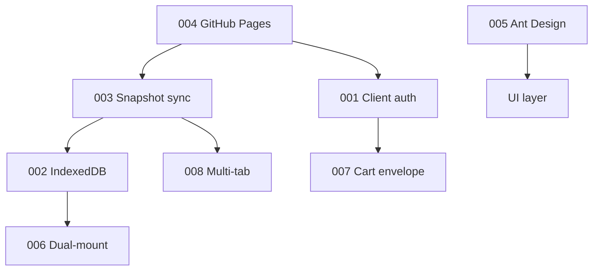

# Архитектурные решения (ADR)

::: tip Статус: проверено по коду
Зафиксированы только **подтверждённые** решения текущей реализации. Альтернативы не выдумываются — где история не задокументирована, это указано явно в каждом ADR.
:::

## Индекс решений

| ADR | Решение | Статус |
| --- | --- | --- |
| [001](/adr/001-client-only-auth) | Client-only auth (HMAC verifier) | Принято |
| [002](/adr/002-indexeddb-catalog) | IndexedDB per storeId | Принято |
| [003](/adr/003-snapshot-sync) | Cloud snapshot sync | Принято |
| [004](/adr/004-github-pages-spa) | CRA + GitHub Pages SPA | Принято |
| [005](/adr/005-ant-design-ui) | Ant Design UI | Принято |
| [006](/adr/006-dual-mount-catalog) | Dual-mount search panels | Принято |
| [007](/adr/007-cart-envelope-v3) | Cart envelope v3 | Принято |
| [008](/adr/008-web-locks-multitab) | Web Locks + BroadcastChannel | Принято |

## Граф зависимостей

## Планируемые ADR (ещё не созданы)

Кандидаты, для которых отдельного ADR пока нет: детальная граница cloud/browser supplier paths и другие решения из [documentation-plan](/documentation-plan). Login query-modal уже зафиксирован вместе с routing/dual-mount в ADR-006, а seeded showcase реализован и проверяется `showcaseSeed.test.js`; эти темы нельзя считать ещё не реализованными.

## Формат ADR

Каждый файл содержит: контекст, проблему, варианты (если известны), решение, причины, плюсы/минусы, последствия, статус, связанные файлы.

## Связанные страницы

- [Ограничения](/00-overview/constraints-and-non-goals)
- [Архитектурные границы](/02-architecture/architectural-boundaries)
- [План документации](/documentation-plan)
